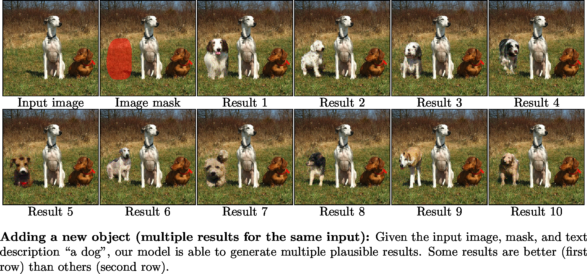
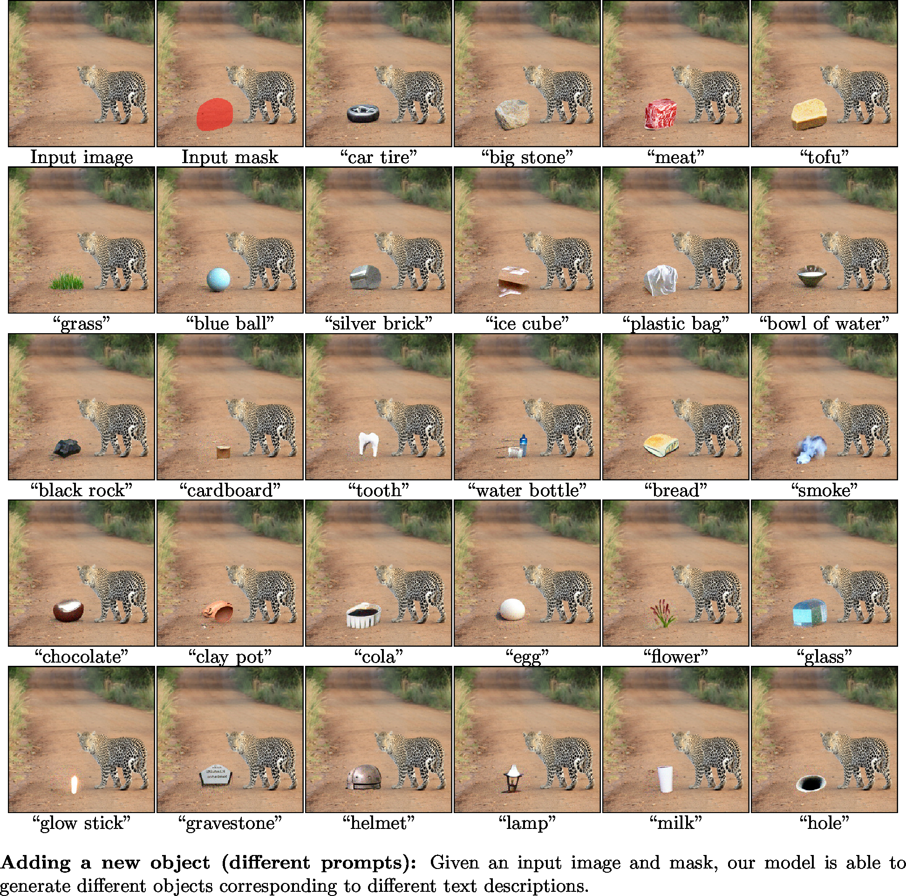
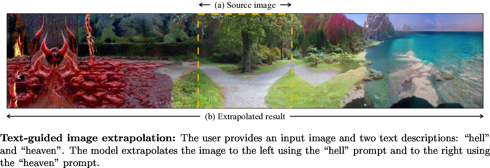
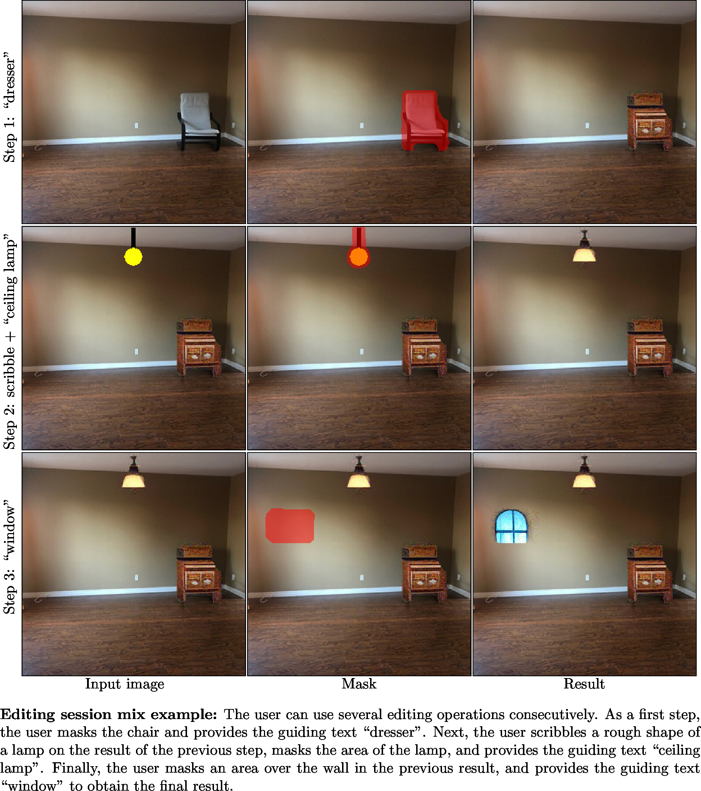

# Getting Started
## Installation
1. Create the virtual environment:

```bash
$ conda create --name blended-diffusion python=3.9
$ conda activate blended-diffusion
$ pip3 install ftfy regex matplotlib lpips kornia opencv-python torch==1.9.0+cu111 torchvision==0.10.0+cu111 -f https://download.pytorch.org/whl/torch_stable.html
```

2. Create a `checkpoints` directory and download the pretrained diffusion model from [here](https://huggingface.co/omriav/blended-diffusion/resolve/main/checkpoints/256x256_diffusion_uncond.pt?download=true) to this folder.

## Image generation
An example of text-driven multiple synthesis results:

```bash
$ python main.py -p "rock" -i "input_example/img.png" --mask "input_example/mask.png" --output_path "output"
```

The generation results will be saved in `output/ranked` folder, ordered by CLIP similarity rank. In order to get the best results, please generate a large number of results (at least 64) and take the best ones.

In order to generate multiple results in a single diffusion process, we utilized batch processing. If you get `CUDA out of memory` try first to lower the batch size by setting `--batch_size 1`.

# Applications

### Multiple synthesis results for the same prompt


### Synthesis results for different prompts


### Altering part of an existing object


### Background replacement


### Scribble-guided editing


### Text-guided extrapolation


### Composing several applications



# Acknowledgments
This code borrows from [omriav](https://github.com/omriav/blended-diffusion),[CLIP](https://github.com/openai/CLIP), [Guided-diffusion](https://github.com/openai/guided-diffusion) and [CLIP-Guided Diffusion](https://colab.research.google.com/drive/12a_Wrfi2_gwwAuN3VvMTwVMz9TfqctNj).

# Reference
@InProceedings{Avrahami_2022_CVPR,
    author    = {Avrahami, Omri and Lischinski, Dani and Fried, Ohad},
    title     = {Blended Diffusion for Text-Driven Editing of Natural Images},
    booktitle = {Proceedings of the IEEE/CVF Conference on Computer Vision and Pattern Recognition (CVPR)},
    month     = {June},
    year      = {2022},
    pages     = {18208-18218}
}
```
